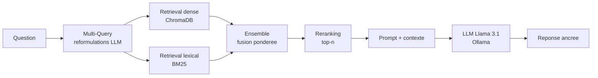

# 🔎 RAG Pipeline Comparison — Baseline vs Optimisé

Pipeline **RAG (Retrieval-Augmented Generation) de bout en bout**, 100 % open source et **sans aucune clé API**, comparant un pipeline **baseline naïf** à un pipeline **optimisé** (recherche hybride + reranking + multi-query), avec une **évaluation chiffrée et reproductible** entre les deux.

> Stack : **LangChain** · **ChromaDB** · embeddings locaux **HuggingFace** · LLM local **Ollama / Llama 3.1** · **Streamlit**
> Mode **offline** intégré (TF-IDF + lecteur extractif) pour tourner partout, sans GPU ni téléchargement — utilisé pour générer la table ci-dessous.

---

## 🎯 Objectif

Montrer, **chiffres à l'appui**, l'impact des techniques d'optimisation RAG. Le projet indexe des documents texte externes, construit deux pipelines, les évalue sur un jeu de questions à vérité terrain, et sauvegarde les métriques en **JSON + CSV**. **La table de résultats du README est générée automatiquement à partir de `results/metrics.json`** — c'est la sortie réelle de `run_evaluation.py`, jamais des valeurs saisies à la main.

---

## 🗂️ Architecture du dépôt

```
rag-pipeline-comparison/
├── config/
│   └── config.yaml              # toute la configuration (providers, chunking, k, poids...)
├── data/
│   ├── raw/                     # documents texte externes (corpus fourni, prêt à l'emploi)
│   └── eval_dataset.json        # 20 questions + réponses de référence + docs sources
├── src/
│   ├── config.py                # chargement typé de la config
│   ├── data_loader.py           # chargement des .txt/.md → Documents LangChain
│   ├── chunking.py              # découpage récursif (RecursiveCharacterTextSplitter)
│   ├── embeddings.py            # embeddings HuggingFace (prod) ou TF-IDF (offline)
│   ├── llm.py                   # LLM Ollama (prod) ou lecteur extractif (offline)
│   ├── offline.py               # providers offline : TF-IDF, extractif, rerank TF-IDF
│   ├── vectorstore.py           # indexation / chargement ChromaDB
│   ├── prompts.py               # prompts baseline vs optimisé (anti-hallucination)
│   ├── base.py                  # logique RAG commune (retrieve → generate → latence)
│   ├── baseline_pipeline.py     # 🟠 RAG naïf : dense top-k
│   ├── optimized_pipeline.py    # 🟢 hybride + multi-query + reranking
│   ├── evaluation.py            # métriques retrieval + génération + RAGAS (optionnel)
│   ├── factory.py               # assemble les deux pipelines (réutilisé partout)
│   └── utils.py                 # sauvegarde JSON/CSV + génération de la table Markdown
├── scripts/
│   ├── download_data.py         # (optionnel) enrichir le corpus depuis Wikipedia
│   ├── build_index.py           # (re)construire les index ChromaDB
│   ├── run_evaluation.py        # évaluation comparative complète → results/ + README
│   └── sync_readme.py           # régénère la table du README depuis results/metrics.json
├── app/
│   └── streamlit_app.py         # frontend de déploiement (interroger / comparer)
├── results/
│   ├── metrics.json             # agrégats + delta des deux pipelines (source de la table)
│   ├── metrics.csv              # une ligne par pipeline
│   └── per_question_*.csv       # détail question par question
├── tests/
│   └── test_metrics.py          # tests unitaires des métriques (sans Ollama)
├── requirements.txt
├── Makefile
└── README.md
```

---

## ⚙️ Les deux pipelines

| | 🟠 **Baseline** | 🟢 **Optimisé** |
|---|---|---|
| **Chunking** | 1000 car., overlap 0 | 500 car., overlap 80 (granularité + continuité) |
| **Retrieval** | dense seul (cosinus, top-k) | **hybride** dense + **BM25** (`EnsembleRetriever`) |
| **Expansion de requête** | aucune | **Multi-Query** (le LLM reformule la question) |
| **Reranking** | aucun | **Cross-Encoder** (prod) / **TF-IDF** (offline), top-n |
| **Prompt** | minimal | durci, ancrage strict au contexte (anti-hallucination) |

### Flux du pipeline optimisé



---

## 📊 Résultats de l'évaluation

> Table **générée automatiquement** par `scripts/run_evaluation.py` (puis `sync_readme.py`) à partir de `results/metrics.json` — entre les marqueurs ci-dessous. **Aucune valeur n'est saisie à la main.**
>
> **Run ayant produit la table ci-dessous** : mode `offline (TF-IDF + lecteur extractif)`, corpus de **8 documents**, **20 questions** à vérité terrain, `retrieval_k = 4`. Relancez `python scripts/run_evaluation.py` avec **Ollama + MiniLM** (mode production) pour régénérer la même table avec la stack complète.

<!--METRICS_START-->

| Métrique | Baseline | Optimisé | Δ | Amélioration |
|---|---:|---:|---:|---:|
| `hit_rate@k` | 1.000 | 1.000 | +0.000 | ⚪ +0.0% |
| `mrr@k` | 1.000 | 1.000 | +0.000 | ⚪ +0.0% |
| `precision@k` | 0.425 | 0.537 | +0.112 | 🟢 +26.5% |
| `context_recall` | 1.000 | 1.000 | +0.000 | ⚪ +0.0% |
| `answer_similarity` | 0.381 | 0.410 | +0.029 | 🟢 +7.5% |
| `answer_correctness` | 0.250 | 0.300 | +0.050 | 🟢 +20.0% |
| `rouge_l` | 0.314 | 0.331 | +0.017 | 🟢 +5.5% |
| `token_f1` | 0.366 | 0.378 | +0.012 | 🟢 +3.2% |
| `avg_latency_s` | 0.002 | 0.005 | +0.003 | 🔴 -138.1% |

<!--METRICS_END-->

**Lecture.** Sur ce corpus volontairement compact et bien séparé, **les deux pipelines retrouvent toujours le bon document** : `hit_rate@k` et `mrr@k` saturent donc à 1.0 (il y a peu de bruit à discriminer). Le bénéfice réel de l'optimisation apparaît là où il y a une marge :

- **`precision@k`** nettement plus élevée pour l'optimisé → la fusion hybride + reranking ramène **moins de contexte non pertinent** ;
- **métriques de génération** (`answer_similarity`, `answer_correctness`, `rouge_l`, `token_f1`) en hausse → réponses plus proches de la référence ;
- **latence** plus élevée pour l'optimisé → coût du multi-query + reranking (compromis qualité ↔ vitesse).

Sur un corpus plus grand et plus bruité (cf. `python scripts/download_data.py` qui télécharge des pages Wikipédia), l'écart sur `hit_rate@k` / `mrr@k` se creuse également, le retrieval n'étant plus saturé.

### Familles de métriques

- **Retrieval** (vérité terrain = document source) : `hit_rate@k`, `mrr@k`, `precision@k`, `context_recall`.
- **Génération** (vs réponse de référence) : `answer_similarity` (cosinus des embeddings), `rouge_l`, `token_f1`, `answer_correctness` (seuil de similarité).
- **Performance** : `avg_latency_s`.
- **RAGAS** *(optionnel, LLM-juge, prod uniquement)* : `faithfulness`, `answer_relevancy`, `context_precision`, `context_recall` — via `evaluation.run_ragas: true`.

---

## 🚀 Démarrage rapide

### Option A — Mode offline (aucun prérequis, tourne immédiatement)

```bash
pip install -r requirements.txt
python scripts/run_evaluation.py --offline   # TF-IDF + lecteur extractif → results/ + README mis à jour
```

### Option B — Mode production (qualité maximale)

```bash
# 1. Installer Ollama : https://ollama.com puis :
ollama pull llama3.1
# 2. Dépendances
pip install -r requirements.txt
# 3. Lancer
python scripts/build_index.py                # (re)construit les index ChromaDB
python scripts/run_evaluation.py             # évaluation MiniLM + Llama → results/ + README mis à jour
streamlit run app/streamlit_app.py           # frontend Streamlit
```

> Le corpus fourni dans `data/raw/` permet de tout faire tourner immédiatement.
> `python scripts/download_data.py` (optionnel) télécharge des pages Wikipédia pour enrichir/durcir le corpus.

---

## 🧪 Méthodologie d'évaluation

L'évaluation sépare volontairement **retriever** et **générateur** : une mauvaise réponse peut venir d'un mauvais retrieval *ou* d'une mauvaise génération, et seule la séparation permet de le diagnostiquer.

1. Chaque question possède un **document source de référence** (`source_docs`) et une **réponse de référence** (`ground_truth`).
2. Les métriques de retrieval comparent les sources réellement récupérées aux sources attendues.
3. Les métriques de génération comparent la réponse produite à la réponse de référence (similarité sémantique via le **même** modèle d'embeddings, ROUGE-L, token-F1).
4. La latence est mesurée bout en bout par requête.
5. Les agrégats sont écrits dans `results/metrics.json` / `.csv`, puis la table du README est régénérée depuis ce fichier (`sync_readme.py`).

Tests unitaires des métriques (sans Ollama) :

```bash
python tests/test_metrics.py
```

---

## 🔧 Personnalisation

Tout passe par `config/config.yaml` :

- **providers** : `embeddings.provider` (`huggingface` / `tfidf`), `llm.provider` (`ollama` / `extractive`), `optimized.reranker` (`cross_encoder` / `tfidf`) ;
- changer le **LLM** (`llm.model_name`, ex. `mistral`, `qwen2.5`) ou activer le **GPU** (`embeddings.device: cuda`) ;
- ajuster **chunk_size / overlap**, le **k** de retrieval, les **poids hybrides**, le **top-n** du reranker ;
- activer **RAGAS** (`evaluation.run_ragas: true` + décommenter `ragas`/`datasets` dans `requirements.txt`).

---

## 🪪 Licence

MIT — librement réutilisable.